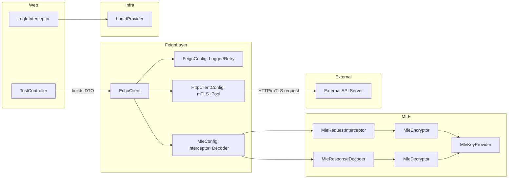
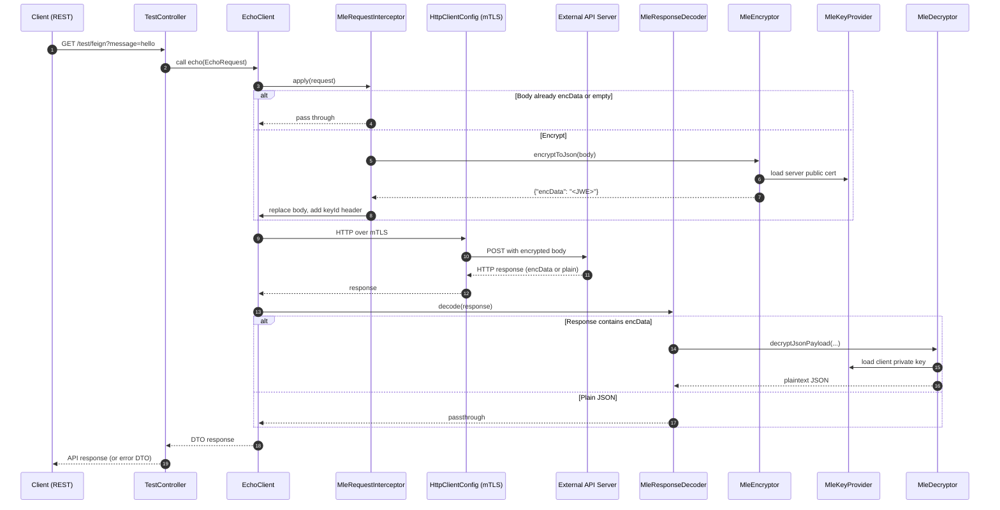
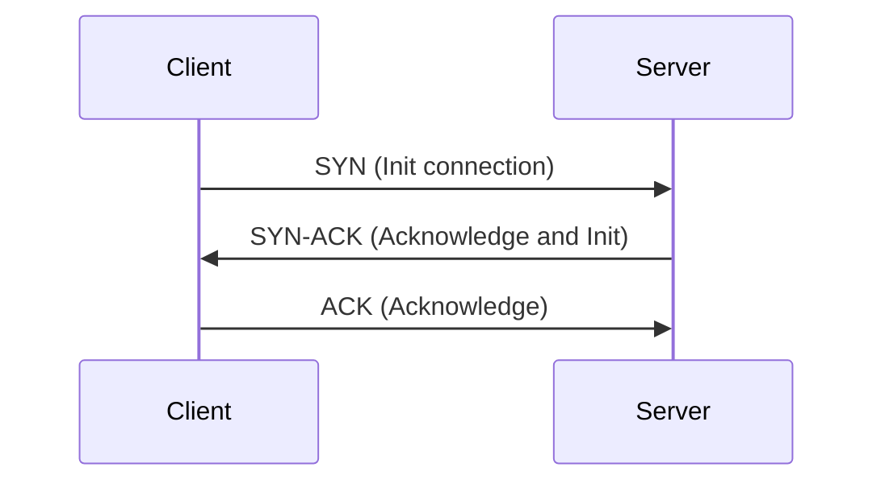
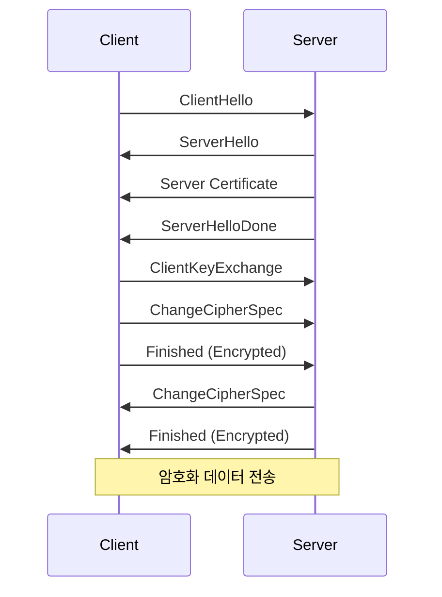
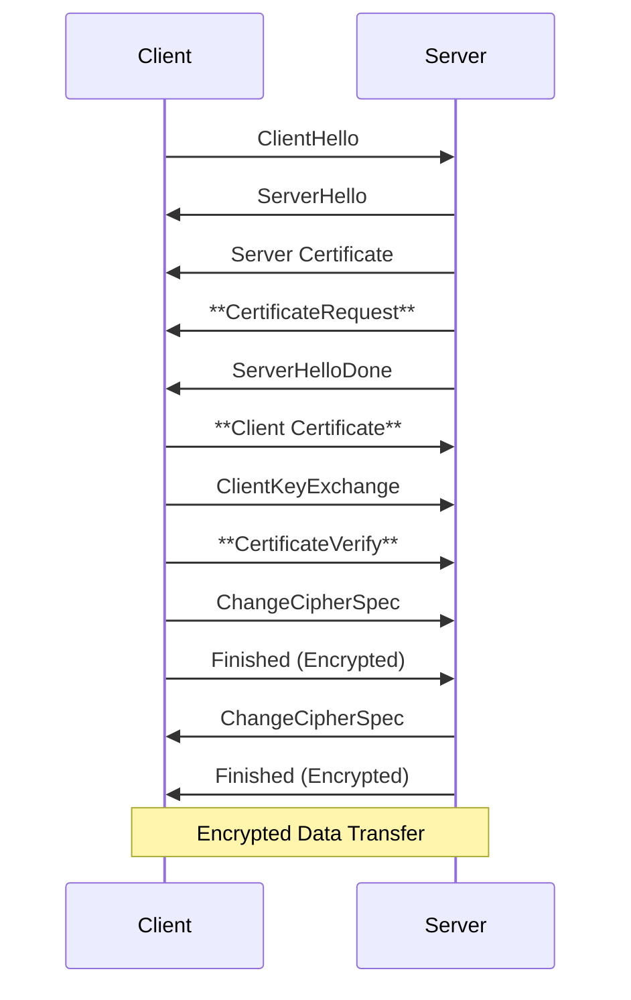
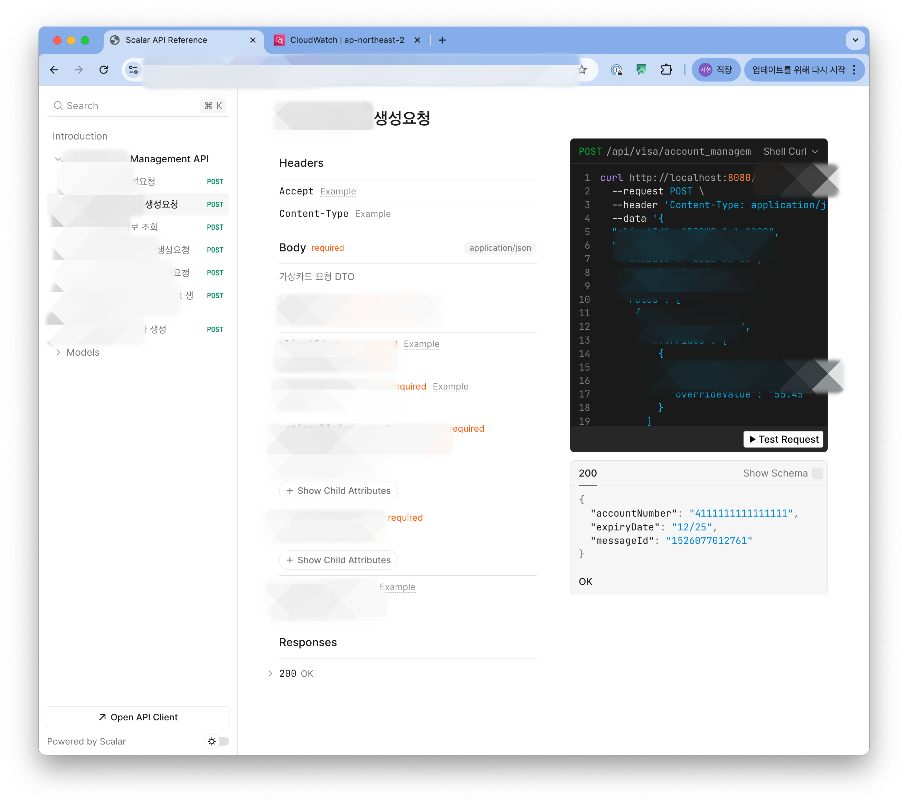
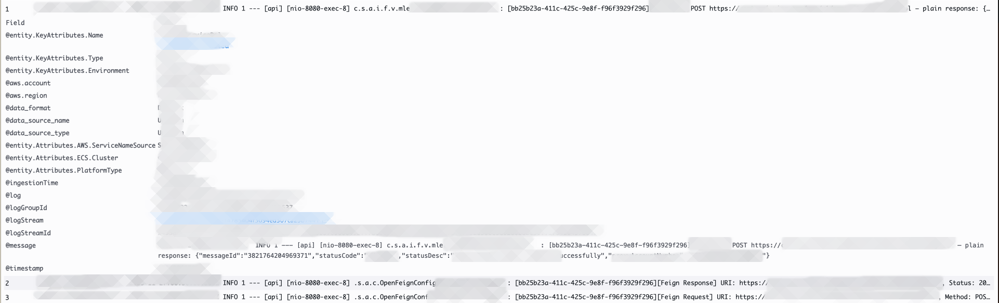

# sslMle

sslMle 는 server-to-server 간 transport-level(SSL/mTLS) 기반 통신 위에 application-level 암호화(eg. Message Level Encryption)를 합친 이중 암호화를 지원하는 서비스를 기반으로 생성한 예제입니다.

## Concept

안전한 통신을 위해 사용되는 프로토콜의 예시로 [TLS](https://en.wikipedia.org/wiki/Transport_Layer_Security) 혹은 [SSL](https://en.wikipedia.org/wiki/Transport_Layer_Security#SSL_1.0,_2.0,_and_3.0) 와 같이 암호화를 통한 안전한 통신은 클라이언트-서버 혹은 서버-서버 간 필수적으로 요구된다.

인증 혹은 결제 등 민감정보를 다루는 과정에서 보안 규약을 구현하는데 있어, 공통적으로 사용하게 되는 SSL/mTLS 와 서비스마다 커스텀으로 요구되는 암호화를 적용하는 범위로 어플리케이션을 구성해본다.

1. **Transport Level Security(SSL/mTLS)** - L5(Session) 혹은 L6 에서 클라이언트, 서버와의 통신에서 데이터 암호화를 지원
2. **Application Level Security (MLE)** - L7(Application) 에서 request/response 에 담긴 payload 를 암복호화를 지원. TLS 연결과 별도로 최종 목적지까지 암호화된 데이터를 보장.

## Architecture

- Stack: Kotlin, SpringBoot, Spring Cloud Feign, Apache HttpClient5, nimbus-jose-jwt(JWT/JWE), BouncyCastle
- Environment: local(MacOS), dev/prod(AWS ECS w.terraform)

API 요청을 위한 Spring Cloud OpenFeign 과 SSL/mTLS context 및 connection pool 지원을 위한 Apache HttpClient5 를 사용. 
SSL/mTLS 및 MLE 관련 로직은 [SpringBoot 포스팅](https://spring.io/blog/2023/06/07/securing-spring-boot-applications-with-ssl) 및 provider 에서 제공하는 문서를 참고하여 별도 모듈 구성

## Key Components

- `TestController` - API 호출 테스트를 위한 end-point Controller
- `EchoClient` - Feign 클라이언트 인터페이스. 주입된 SSL/mTLS 및 MLE 설정을 통해 Provider 와 통신
- `HttpClientConfig` - mTLS 설정 및 Connection Pool 관련 설정 Bean
- `MleConfig` - Provider 에 맞는 MLE 설정 Bean
  - `MleRequestInterceptor` - HTTP 요청 시 body 를 `encData` 로 암호화
  - `MleResponseDecoder` - HTTP 응답 시 body(`encData`)를 복호화
- `MleEncryptor` / `MleDecryptor` / `MleKeyProvider` - MLE 암복호화 및 키 로딩 구현체
- `FeignConfig` - Feign 공통 설정 (로깅, 재시도 등) Bean
- `LogIdInterceptor` + `LogIdProvider` - 각 HTTP/non-HTTP에 고유한 `logId` 생성 및 주입. Slf4j MDC에 `logId` 를 설정하여 구동

### Component Diagram

### Request Flow Sequence

## Implementation Details

### SSL/TLS HandShake 비교

**TCP 3-way handshake**

**One-way SSL**

> - ClientHello: Client 가 TLS 버전, cipher suite 등 전달. init.
> - ServerHello/Certificate: Server 가 cipher suite 동의 후 public certificate 전달
> - ClientKeyExchange: Client 가 전달받은 Server certificate 을 root CA 를 통해 검증 후, Server 의 공개키(publicKey) 로 암호화한 세션키 생성. 이후 해당키 전달
> - Finished: Client-Server 간 handshake 마무리 후, 세션키를 기반으로 암호화 통신 진행

**mTLS (Two-way SSL)**

> - One-way SSL 통신 과정 속 아래 3가지 과정 포함
> - CertificateRequest: Server 의 certificate 전달 후, Server 가 Client 측 certificate 요청
> - Client Certificate: Client 가 Server 에게 public certificate 전달. Server 는 truststore(상대측 자격증명 저장소) 를 통해 검증
> - CertificateVerify: Client 가 개인키(privateKey)로 암호화한 서명을 보냄으로써 본인이 보낸 인증서를 갖고 있음을 증명

| Aspect               | Standard TLS (One-Way)        | Mutual TLS (mTLS)                           |
| -------------------- | ----------------------------- | ------------------------------------------- |
| **Authentication**   | Server only                   | **Both client and server**                  |
| **Client Certificate** | Not required                | **Required**                                |
| **Key Handshake Msgs** | `Server Certificate`        | + `CertificateRequest` + `Client Certificate` + `CertificateVerify` |
| **Primary Use Case** | Browser-to-website            | **Server-to-server**, secure APIs           |
| **Configuration**    | Client: **Truststore**        | Both: **Keystore** + **Truststore**         |

### Feign Integration

Provider 서버와 통신에 필요한 요소는 Configuration Bean 으로 주입

- `FeignConfig` - Provider 외에 기타 HTTP 통신에도 사용하기 위한 logging, formatter, retryer 관련 Bean 설정
- `HttpClientConfig` - 서버 간 SSL(mTLS) 연결을 위한 SSL Context 관련 Bean 설정
- `MleConfig` - Provider 요구사항 중 application-level payload 암복호화 관련 Bean 설정
  - [RequestInterceptor](https://github.com/OpenFeign/feign/blob/master/core/src/main/java/feign/RequestInterceptor.java), [feign.codec.Decoder](https://github.com/OpenFeign/feign/blob/master/core/src/main/java/feign/codec/Decoder.java) 오버라이딩을 통해 POST/PUT 의 request/response 암복화 지원
  - 암복호화 및 key management 역할에 맞춰 컴포넌트 구성

### SSL/mTLS

- `HttpClientConfig` 내부에서 `SSLContext`를 통한 SSL connection 처리
- `Apache HttpClient 5 (feign-hc5)` 를 client 구현체로 사용
- mTLS 지원과, connection pooling 을 통해 성능 최적화
  - TCP/SSL handshake 중복 생략 (10-50ms per request)
  - port exhaustion 예방 (TIME_WAIT 예방)
  - connection health (stale connection 자동 관리)

### Message Level Encryption (MLE)

Provider 에서 요구한 JWE 기반 암호화 방식(MLE)을 지원하기 위해 `Nimbus JOSE` + JWT 라이브러리 사용
- **Key Encryption**: RSA-OAEP-256
- **Content Encryption**: AES-GCM (128-bit)
- **Keys management**: `MleKeyProvider` 를 통한 PEM 혹은 P12 키/인증서 관리

## Configuration Reference

### Connection Pool Configuration
| Property | Description                  | Default |
| :--- |:-----------------------------| :--- |
| `http.client.pool.max-total` | 최대 가용할 총 connection pool 수   | `100` |
| `http.client.pool.max-per-route` | route 별 최대 connections 수     | `20` |

### SSL/mTLS Configuration
| Property | Description                 | Default  |
| :--- |:----------------------------|:---------|
| `ssl.enabled` | SSL/mTLS 사용여부               | `false`  |
| `ssl.key-store.location` | client KeyStore 경로          | `null`   |
| `ssl.key-store.password` | client KeyStore Password    | `""`       |
| `ssl.key-store.type` | KeyStore type (e.g. PKCS12) | `PKCS12` |
| `ssl.trust-store.location` | TrustStore 경로               | `null`   |
| `ssl.trust-store.password` | TrustStore Password         | `""`     |

### MLE Configuration
| Property | Description                       | Default |
| :--- |:----------------------------------| :--- |
| `mle.enabled` | MLE 사용여부                          | `false` |
| `mle.key-id` | MLE key Identifier                | `null` |
| `mle.key-id-header-name` | MLE keyId HTTP header name        | `keyId` |
| `mle.server-certificate-location` | server public certificate 경로      | `null` |
| `mle.client-private-key-location` | client private key 경로             | `null` |
| `mle.client-private-key-passphrase` | private key Passphrase (optional) | `null` |

# Result

